# clfc02d3 🖼️💻📦
clfc02d3 : Amazon Machine Image # AMI # EC2 # EBS # CLF-C02

## Objective
- To create Amazon EC2 instance & Amazon EBS volume.
- To create an AMI from the instance.
- To terminate EC2 instance & delete EBS volume.

## Exploring AMI, EC2 & EBS

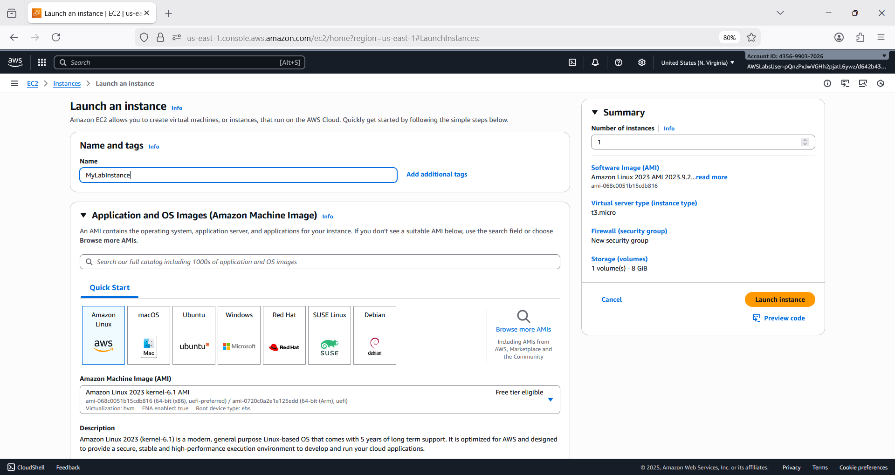

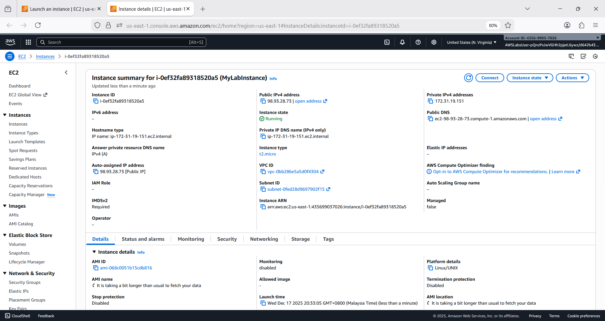

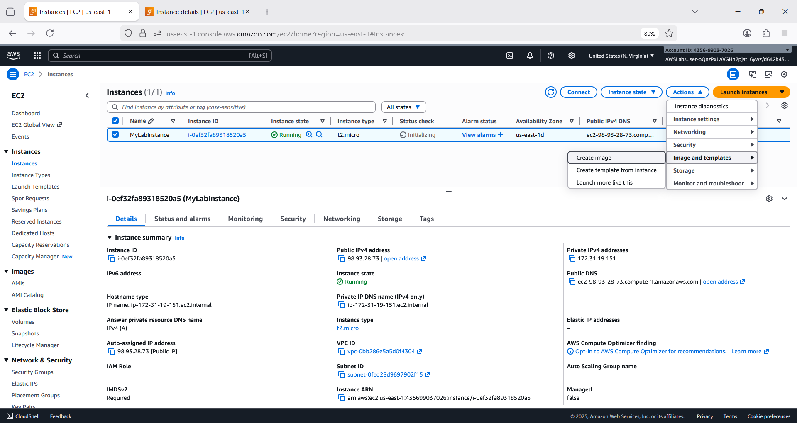

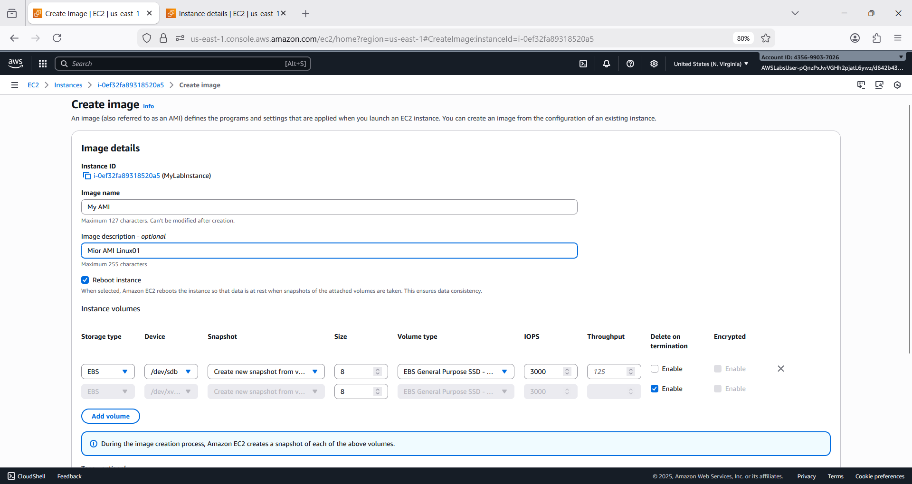

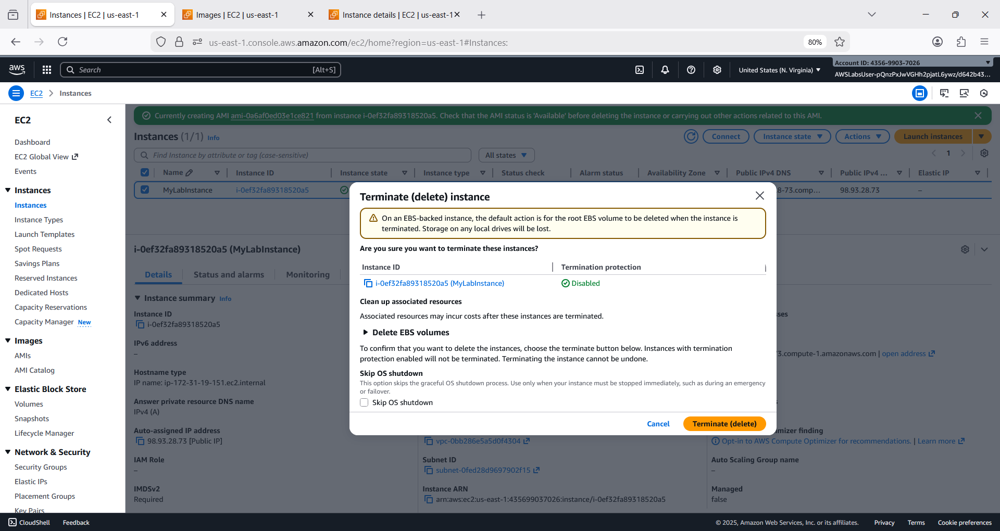

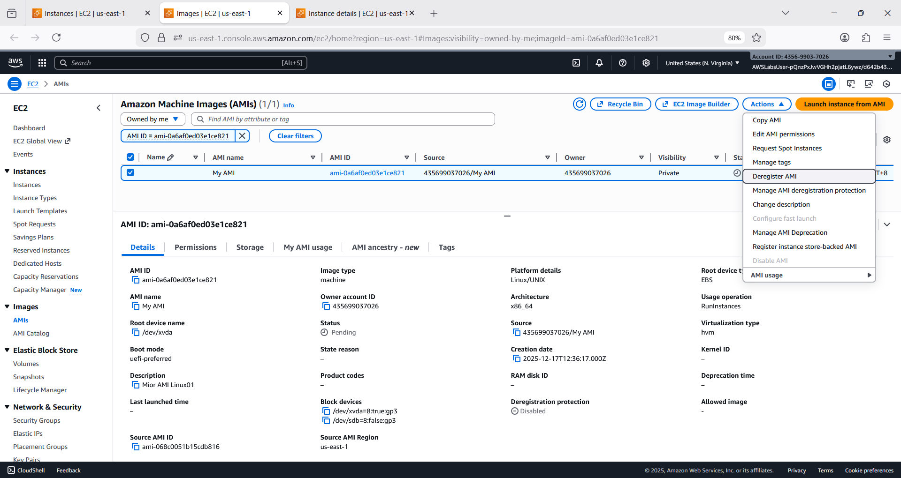

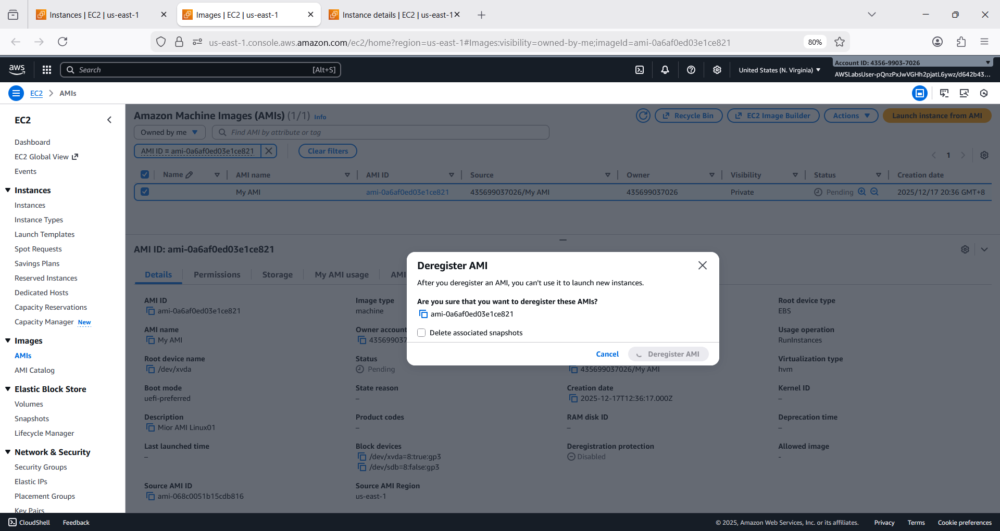

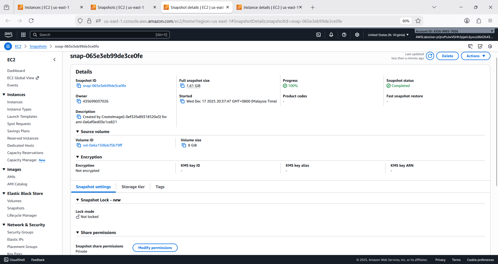

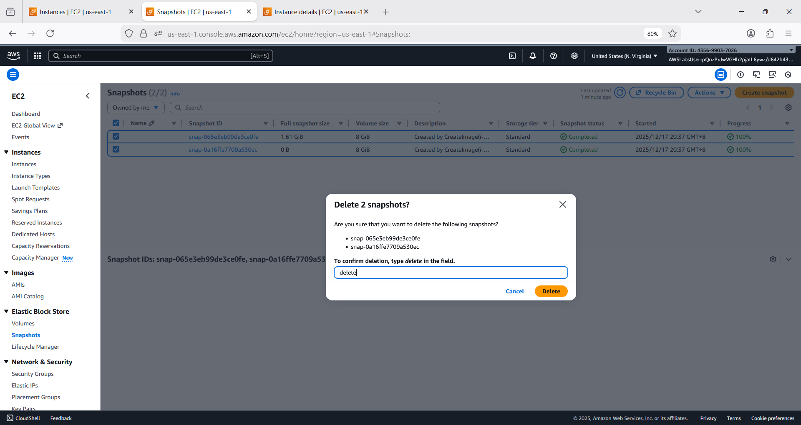

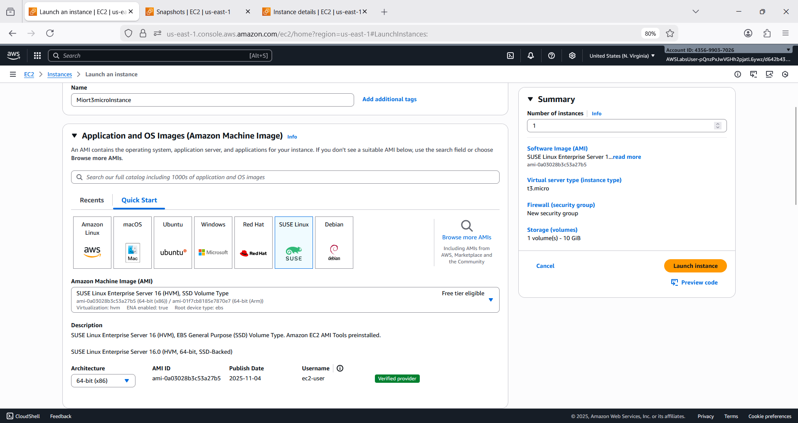

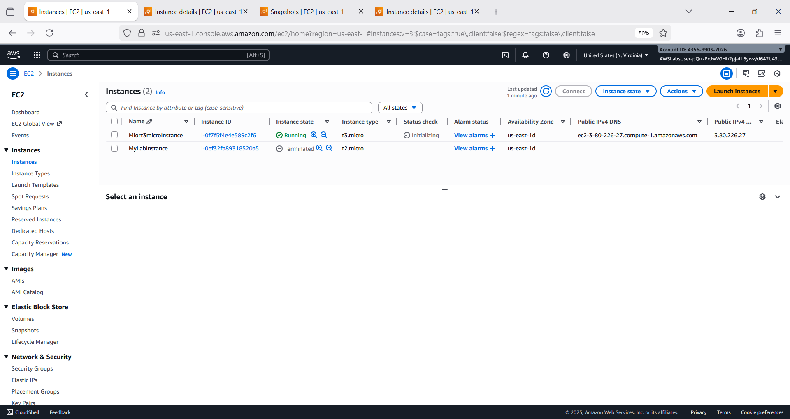

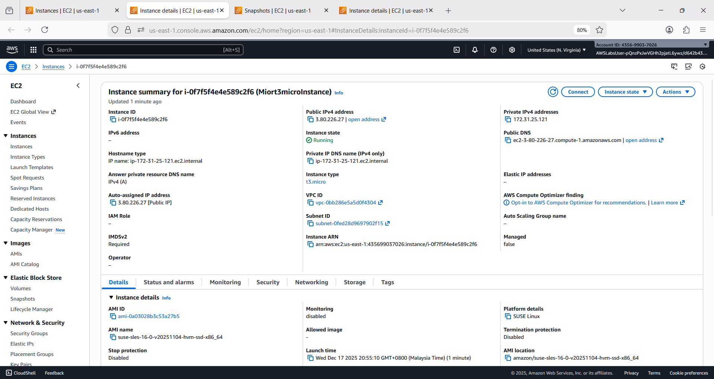

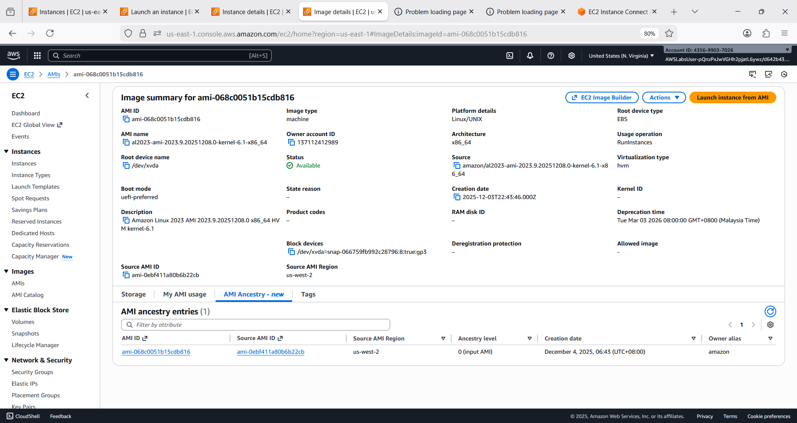

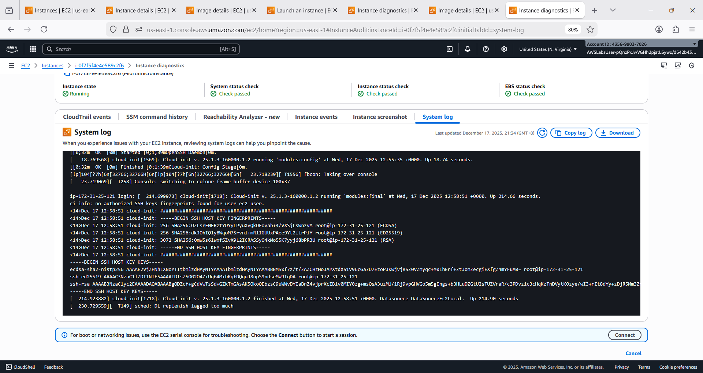

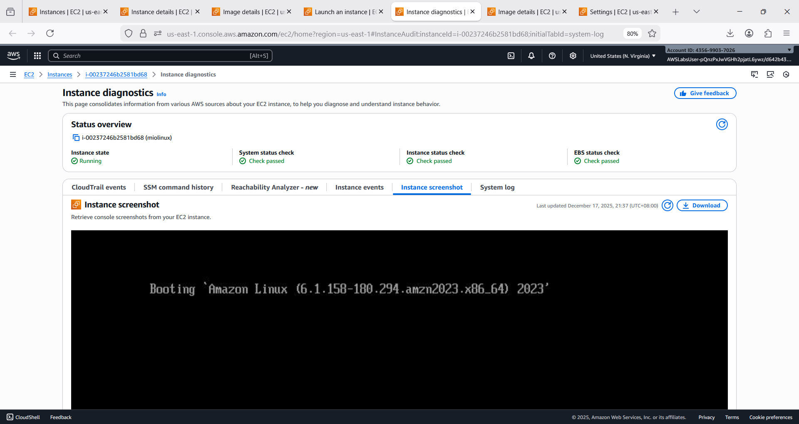

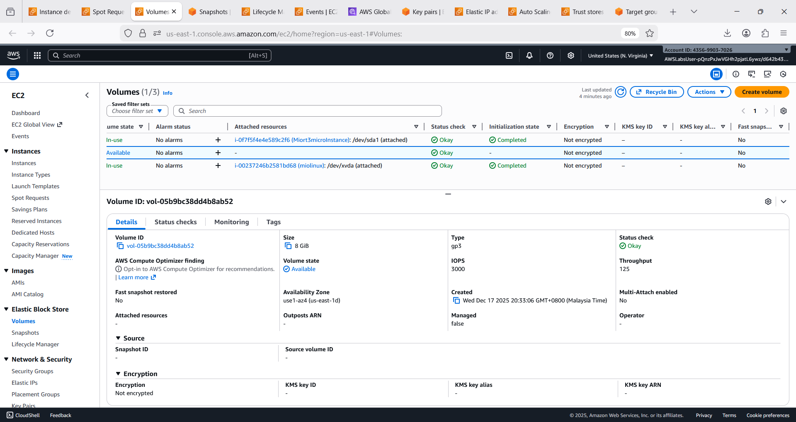

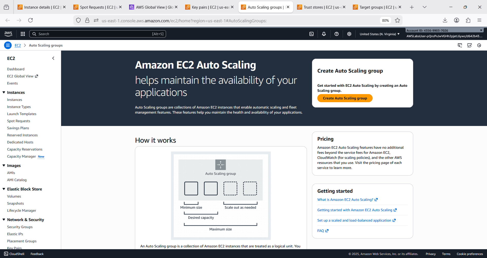

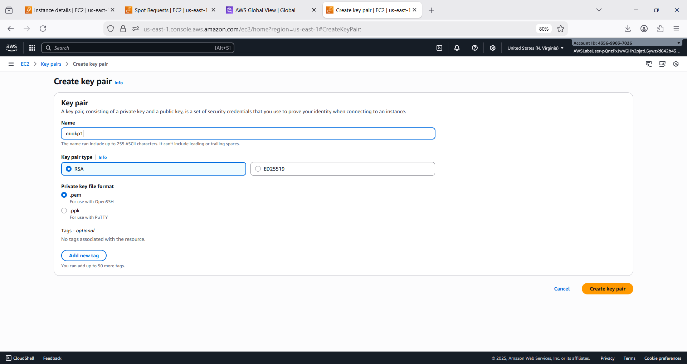

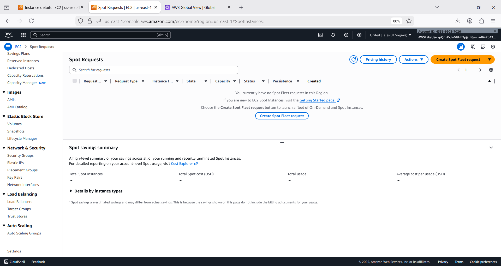

